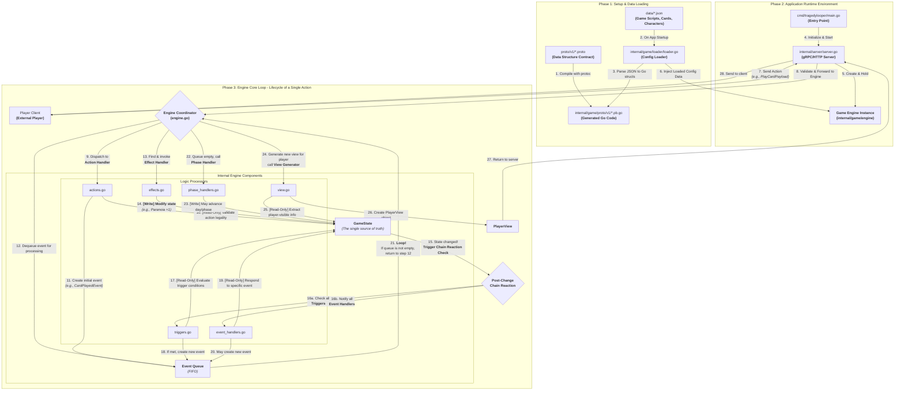

# Tragedy Looper

A Go implementation of the Tragedy Looper board game. This project is a Go-based server for the Tragedy Looper game, allowing players to connect and play through a client-server architecture. It also includes an AI opponent powered by Large Language Models (LLMs).

## Description

This project is a Go-based server for the Tragedy Looper game. The core game logic is written in Go, and it uses protobuf for data serialization and gRPC for communication between the server and clients. The game also features an AI opponent that uses LLMs to make decisions.

## Getting Started

### Prerequisites

- Go 1.x
- Git
- Buf
- protoc-gen-go
- protoc-gen-jsonschema

### Installation

1.  **Clone the repository:**
    ```sh
    git clone https://github.com/your-username/tragedyLooper.git
    cd tragedyLooper
    ```

2.  **Install tools:**
    ```sh
    make install-tools
    ```

3.  **Generate protobuf files:**
    ```sh
    make proto
    ```

4.  **Tidy up the dependencies:**
    ```sh
    go mod tidy
    ```

## Usage

### Running the application

To run the application, use the following command:

```sh
make run
```

This will start the game server.

### Building the application

To build the application, use the following command:

```sh
make build
```

This will create a binary in the `bin` directory.

### Running tests

To run the tests, use the following command:

```sh
make test
```

### Linting the code

To lint the code, use the following command:

```sh
make lint
```

### Cleaning the project

To clean the project, use the following command:

```sh
make clean
```

This will remove the `bin` directory.

## Project Structure

```
. (tragedyLooper)
|-- cmd/tragedylooper/main.go   # Main application entry point
|-- data/                         # Game data and JSON schemas
|-- internal/                     # Private application and library code
|   |-- game/                     # Core game logic and models
|   |-- llm/                      # LLM client and integration
|   `-- server/                   # Server and client connection handling
|-- pkg/
|-- proto/                        # Protobuf definitions
|-- tools/                        # Helper scripts
|-- go.mod
|-- go.sum
|-- Makefile
`-- README.md
```

## Core Architecture and Flow

The project is built around an event-driven game engine that processes player actions and manages game state through a series of immutable events and chain reactions. The following diagram illustrates the complete lifecycle of a single player action.



### Flow Explanation

#### Phase 1: Setup & Data Loading

1.  **Define Contracts (`.proto`)**: All core game data structures (Characters, Cards, Events, etc.) are defined in `.proto` files.
2.  **Generate Code (`.pb.go`)**: Before compilation, the `protoc` tool generates Go structs and serialization methods from the `.proto` files. This ensures type safety.
3.  **Load Configuration (`.json`)**: On application startup, the `loader` module reads JSON files from the `data/` directory. These files define the actual game content (scripts, card effects, etc.). The loader parses this JSON data into the Go structs generated in step 2.

#### Phase 2: Application Startup

4.  **Entry Point (`main.go`)**: The application starts here, initializing logging, configuration, and the main server.
5.  **Server (`server.go`)**: The server (gRPC or HTTP) listens for network requests, manages client connections, and holds an instance of the core **Game Engine**.
6.  **Engine Initialization**: When creating the game engine instance, the server "injects" the loaded game configuration data from Phase 1 into it. This makes the engine aware of all available cards, characters, and rules.

#### Phase 3: The Core Game Loop

This is the complete response flow for a single player action:

7.  **Receive Action**: A player's client sends an action (e.g., "Play Card") to the server.
8.  **Dispatch Action**: The server forwards the action to the game engine for processing.
9.  **Action Handling (`actions.go`)**: The engine first calls the **Action Handler**.
10. **Validate Legality**: The action handler **reads** the current `GameState` to verify that the action is legal (e.g., does the player have this card?).
11. **Create Initial Event**: If the action is legal, the handler creates an event describing it (e.g., `CardPlayedEvent`) and places it into the **Event Queue**.
12. **Process Event**: The engine's main loop retrieves an event from the queue.
13. **Execute Effects (`effects.go`)**: The engine looks up the effects associated with the event and calls the **Effect Handler**.
14. **Mutate State**: The **Effect Handler is the only component that modifies the `GameState`**. It performs the specific operation, like "Paranoia +1".
15. **Trigger Chain Reaction**: Any change to the `GameState` immediately triggers a checkpoint.
16. **Check Triggers and Handlers**:
    *   **`triggers.go`**: Checks if any script or rule conditions have been met due to the state change.
    *   **`event_handlers.go`**: Checks if any modules need to respond to the specific type of event that just occurred.
17. **Create New Events**: If a trigger or handler determines that a follow-up action is needed, it creates a **new event** and adds it to the event queue.
18. **The Loop**: **This is the engine's heartbeat**. As long as the event queue is not empty, the process returns to step 12, continuously processing new events caused by previous ones until all chain reactions are complete.
19. **Advance Phase (`phase_handlers.go`)**: When the event queue is empty, the action and all its consequences are fully resolved. The engine then calls the **Phase Handler** to check if the game day or phase should advance.
20. **Generate View (`view.go`)**: The engine calls the **View Generator**, which reads the final `GameState` and filters out all information not visible to a specific player (e.g., other players' hands, unrevealed roles).
21. **Return View**: The resulting `PlayerView` is returned to the server, which then sends it to the player's client to update the UI.

This complete, event-driven loop allows the game logic to handle complex causal chains while keeping the individual components modular and clear.

## Contributing

Contributions are welcome! Please feel free to submit a pull request.

1.  Fork the Project
2.  Create your Feature Branch (`git checkout -b feature/AmazingFeature`)
3.  Commit your Changes (`git commit -m 'Add some AmazingFeature')
4.  Push to the Branch (`git push origin feature/AmazingFeature`)
5.  Open a Pull Request
