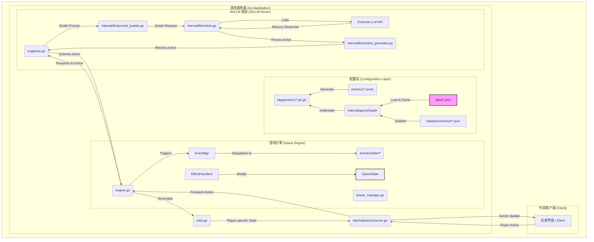
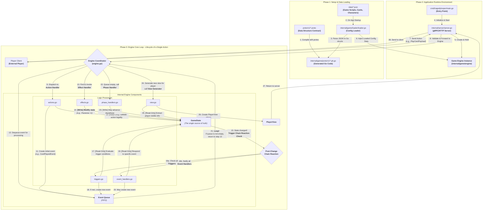

# Tragedy Looper

> **Note:** This project is currently under active development. The API and features are subject to change.

A Go implementation of the Tragedy Looper board game. This project is a Go-based server for the Tragedy Looper game, allowing players to connect and play through a client-server architecture. It also includes an AI opponent powered by Large Language Models (LLMs).

## Getting Started

### Prerequisites

- Go 1.x
- Git
- Buf
- protoc-gen-go
- protoc-gen-jsonschema

### Installation

1.  **Clone the repository:**
    ```sh
    git clone https://github.com/constellation39/tragedyLooper.git
    cd tragedyLooper
    ```

2.  **Install tools:**
    ```sh
    make install-tools
    ```

3.  **Generate protobuf files:**
    ```sh
    make proto
    ```

4.  **Tidy up the dependencies:**
    ```sh
    go mod tidy
    ```

## Usage

### Running the application

To run the application, use the following command:

```sh
make run
```

This will start the game server.

### Building the application

To build the application, use the following command:

```sh
make build
```

This will create a binary in the `bin` directory.

### Running tests

To run the tests, use the following command:

```sh
make test
```

### Linting the code

To lint the code, use the following command:

```sh
make lint
```

## Project Structure

A brief overview of the key directories in this project.

```
. (tragedyLooper)
|-- cmd/tragedylooper/main.go   # Main application entry point.
|-- data/                         # All game data (cards, characters, scripts) and their JSON schemas.
|-- internal/                     # Private application code, not intended for import by other projects.
|   |-- game/                     # The core game engine, state management, and logic.
|   |-- llm/                      # Handles all communication with the external Large Language Model for AI.
|   `-- server/                   # The gRPC/HTTP server that handles client connections and communication.
|-- pkg/                          # Public library code, safe for other projects to import (e.g., generated protobuf code).
|-- proto/                        # The "source of truth" for data structures, defined in .proto files.
|-- tools/                        # Helper scripts and small applications for development.
|-- go.mod                        # Go module definitions.
|-- go.sum                        # Go module checksums.
|-- Makefile                      # Contains all build, test, and run commands.
`-- README.md                     # You are here.
```

## Architecture

The project's architecture is modern, robust, and well-suited for a complex, stateful game like Tragedy Looper. It is driven by several key principles, resulting in a clear and maintainable codebase.

### High-Level Design

1.  **Configuration Driven:** The entire game's content—cards, characters, scripts, and incidents—is defined in external JSON files (`data/`). This decouples the game logic from the game data, allowing for easy updates and modifications to game content without changing any code. The use of JSON schemas (`data/jsonschema/`) ensures this data remains valid and consistent.

2.  **Event-Driven Core Engine:** The game's heart (`internal/game/engine/`) operates on an event-driven model. Player actions, AI decisions, and internal game mechanics do not directly modify the game state. Instead, they generate **events** (e.g., `CardPlayedEvent`). These events are processed by dedicated handlers (`internal/game/engine/eventhandler/`) which in turn trigger **effects** (`internal/game/engine/effecthandler/`). This approach elegantly handles complex chain reactions and makes the game logic easy to extend and debug.

3.  **AI/LLM Integration:** A standout feature is the integration of a Large Language Model (LLM) for AI decision-making (`internal/llm/`). The system builds a context-aware prompt from the current game state (`PlayerView`), sends it to an external LLM, and parses the response back into a valid game action. This allows for sophisticated and less predictable AI behavior.

4.  **Contract-First with Protobuf:** All data models are formally defined using Protobuf (`proto/v1/`). This creates a strict "contract" for data structures used throughout the application, from the game engine to the server API, ensuring type safety and consistency.

### System Data Flow

The following diagram illustrates the interaction between these core components. It shows the complete loop from data loading and player interaction to AI decision-making and state updates.



### Lifecycle of a Player Action

To understand how the engine works in detail, let's trace the complete lifecycle of a single player action. The project is built around an event-driven game engine that processes player actions and manages game state through a series of immutable events and chain reactions.



#### Flow Explanation

*   **Phase 1: Setup & Data Loading**
    1.  **Define Contracts (`.proto`)**: All core game data structures (Characters, Cards, Events, etc.) are defined in `.proto` files.
    2.  **Generate Code (`.pb.go`)**: Before compilation, the `protoc` tool generates Go structs and serialization methods from the `.proto` files. This ensures type safety.
    3.  **Load Configuration (`.json`)**: On application startup, the `loader` module reads JSON files from the `data/` directory. These files define the actual game content (scripts, card effects, etc.). The loader parses this JSON data into the Go structs generated in step 2.

*   **Phase 2: Application Startup**
    4.  **Entry Point (`main.go`)**: The application starts here, initializing logging, configuration, and the main server.
    5.  **Server (`server.go`)**: The server (gRPC or HTTP) listens for network requests, manages client connections, and holds an instance of the core **Game Engine**.
    6.  **Engine Initialization**: When creating the game engine instance, the server "injects" the loaded game configuration data from Phase 1 into it. This makes the engine aware of all available cards, characters, and rules.

*   **Phase 3: The Core Game Loop**
    This is the complete response flow for a single player action:
    7.  **Receive Action**: A player's client sends an action (e.g., "Play Card") to the server.
    8.  **Dispatch Action**: The server forwards the action to the game engine for processing.
    9.  **Action Handling (`actions.go`)**: The engine first calls the **Action Handler**.
    10. **Validate Legality**: The action handler **reads** the current `GameState` to verify that the action is legal (e.g., does the player have this card?).
    11. **Create Initial Event**: If the action is legal, the handler creates an event describing it (e.g., `CardPlayedEvent`) and places it into the **Event Queue**.
    12. **Process Event**: The engine's main loop retrieves an event from the queue.
    13. **Execute Effects (`effects.go`)**: The engine looks up the effects associated with the event and calls the **Effect Handler**.
    14. **Mutate State**: The **Effect Handler is the only component that modifies the `GameState`**. It performs the specific operation, like "Paranoia +1".
    15. **Trigger Chain Reaction**: Any change to the `GameState` immediately triggers a checkpoint.
    16. **Check Triggers and Handlers**:
        *   **`triggers.go`**: Checks if any script or rule conditions have been met due to the state change.
        *   **`event_handlers.go`**: Checks if any modules need to respond to the specific type of event that just occurred.
    17. **Create New Events**: If a trigger or handler determines that a follow-up action is needed, it creates a **new event** and adds it to the event queue.
    18. **The Loop**: **This is the engine's heartbeat**. As long as the event queue is not empty, the process returns to step 12, continuously processing new events caused by previous ones until all chain reactions are complete.
    19. **Advance Phase (`phase_handlers.go`)**: When the event queue is empty, the action and all its consequences are fully resolved. The engine then calls the **Phase Handler** to check if the game day or phase should advance.
    20. **Generate View (`view.go`)**: The engine calls the **View Generator**, which reads the final `GameState` and filters out all information not visible to a specific player (e.g., other players' hands, unrevealed roles).
    21. **Return View**: The resulting `PlayerView` is returned to the server, which then sends it to the player's client to update the UI.

This complete, event-driven loop allows the game logic to handle complex causal chains while keeping the individual components modular and clear.