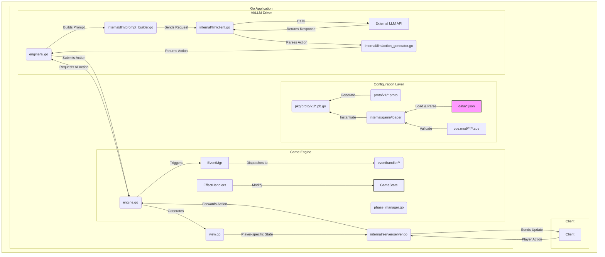

# Tragedy Looper

> **Note:** This project is currently under active development. The API and features are subject to change.

A Go implementation of the Tragedy Looper board game. This project is a Go-based server for the Tragedy Looper game, allowing players to connect and play through a client-server architecture. It also includes an AI opponent powered by Large Language Models (LLMs).

## Getting Started

### Prerequisites

- Go 1.x
- Git
- Buf
- protoc-gen-go

### Installation

1.  **Clone the repository:**
    ```sh
    git clone https://github.com/constellation39/tragedyLooper.git
    cd tragedyLooper
    ```

2.  **Install tools:**
    ```sh
    make install-tools
    ```

3.  **Generate protobuf files:**
    ```sh
    make proto
    ```

4.  **Tidy up the dependencies:**
    ```sh
    go mod tidy
    ```

## Usage

### Running the application

To run the application, use the following command:

```sh
make run
```

This will start the game server.

### Building the application

To build the application, use the following command:

```sh
make build
```

This will create a binary in the `bin` directory.

### Running tests

To run the tests, use the following command:

```sh
make test
```

### Linting the code

To lint the code, use the following command:

```sh
make lint
```

## Project Structure

A brief overview of the key directories in this project.

```
. (tragedyLooper)
|-- cmd/tragedylooper/main.go   # Main application entry point.
|-- data/                         # All game data (cards, characters, scripts).
|-- cue.mod/                      # CUE definitions for game data validation.
|-- internal/                     # Private application code, not intended for import by other projects.
|   |-- game/                     # The core game engine, state management, and logic.
|   |-- llm/                      # Handles all communication with the external Large Language Model for AI.
|   `-- server/                   # The gRPC/HTTP server that handles client connections and communication.
|-- pkg/                          # Public library code, safe for other projects to import (e.g., generated protobuf code).
|-- proto/                        # The "source of truth" for data structures, defined in .proto files.
|-- tools/                        # Helper scripts and small applications for development.
|-- go.mod                        # Go module definitions.
|-- go.sum                        # Go module checksums.
|-- Makefile                      # Contains all build, test, and run commands.
`-- README.md                     # You are here.
```

## Architecture

The project's architecture is modern, robust, and well-suited for a complex, stateful game like Tragedy Looper. It is driven by several key principles, resulting in a clear and maintainable codebase.

### High-Level Design

1.  **Configuration Driven:** The entire game's content—cards, characters, scripts, and incidents—is defined in external JSON files (`data/`). This decouples the game logic from the game data, allowing for easy updates and modifications to game content without changing any code. The use of CUE (`cue.mod/`) ensures this data remains valid and consistent.

2.  **Event-Driven Core Engine:** The game's heart (`internal/game/engine/`) operates on an event-driven model. Player actions, AI decisions, and internal game mechanics do not directly modify the game state. Instead, they generate **events** (e.g., `CardPlayedEvent`). These events are processed by dedicated handlers (`internal/game/engine/eventhandler/`) which in turn trigger **effects** (`internal/game/engine/effecthandler/`). This approach elegantly handles complex chain reactions and makes the game logic easy to extend and debug.

3.  **AI/LLM Integration:** A standout feature is the integration of a Large Language Model (LLM) for AI decision-making (`internal/llm/`). The system builds a context-aware prompt from the current game state (`PlayerView`), sends it to an external LLM, and parses the response back into a valid game action. This allows for sophisticated and less predictable AI behavior.

4.  **Contract-First with Protobuf:** All data models are formally defined using Protobuf (`proto/v1/`). This creates a strict "contract" for data structures used throughout the application, from the game engine to the server API, ensuring type safety and consistency.

### System Data Flow

The following diagram illustrates the interaction between these core components. It shows the complete loop from data loading and player interaction to AI decision-making and state updates.



### Lifecycle of a Player Action

To understand how the engine works in detail, let's trace the complete lifecycle of a single player action. The project is built around an event-driven game engine that processes player actions and manages game state through a series of immutable events and chain reactions.

